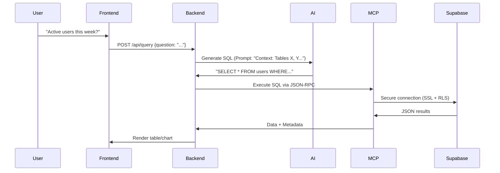

### **Detailed Technical Summary**

---

#### **1. What is the Model Context Protocol (MCP)?**
The **MCP** is an open protocol that acts as a standardized bridge between AI models (like Claude, GPT-4) and development environments/data sources. Its architecture is based on:

- **Client-Host-Server**:  
  ```mermaid
  graph LR
    A[Client: Web Interface] --> B[Host: Next.js]
    B --> C[MCP Server: Node.js]
    C --> D[Supabase: PostgreSQL]
    C --> E[AI: Claude API]
  ```

- **Technical Operation**:
  - **JSON-RPC 2.0**: All communications use structured JSON messages.
  - **Messages**:
    ```json
    // Example query from AI
    {
      "jsonrpc": "2.0",
      "id": 123,
      "method": "database/query",
      "params": {
        "sql": "SELECT COUNT(*) FROM users WHERE last_login > NOW() - INTERVAL '7 DAYS'"
      }
    }
    ```
  - **Security**: 
    - All database access is **read-only**.
    - The MCP server acts as a proxy, never exposing credentials directly to the AI.

---

#### **2. SQLito Architecture**

**Interface Components**:
- **Chat Terminal Style**: Terminal-style chat interface for natural language queries
- **Database Selectors**: Quick switching between environments (production, development, analytics)
- **SQL Visualization**: Transparency by showing generated SQL alongside results
- **Message Management**: Features to copy, delete and regenerate queries

**End-to-End Flow**:


---

#### **3. Key Components**

**a. Supabase Integration**:
- **OAuth 2.0 Connection**:
  - We use PKCE for secure flow.
  - **Strict Permissions**:
    ```yaml
    scopes:
      - database:read
      - projects:read
    ```
  - **Token Management**:
    ```typescript
    // Example of secure storage
    const encryptedToken = crypto.subtle.encrypt(
      { name: 'AES-GCM', iv: new TextEncoder().encode('UNIQUE_IV') },
      derivedKey,
      new TextEncoder().encode(access_token)
    );
    ```

**b. Custom MCP Server**:
- **Configuration**:
  ```javascript
  const { Server } = require('@modelcontextprotocol/sdk');
  const mcpServer = new Server({
    name: 'supabase-connector',
    capabilities: {
      resources: {
        // Enable access to specific tables
        allowedTables: ['users', 'sales']
      }
    }
  });
  ```
- **SQL Handlers**:
  ```javascript
  mcpServer.onRequest('database/query', async (params) => {
    const result = await supabase.query(params.sql);
    return { data: result, error: null };
  });
  ```

**c. AI (Claude 3 Sonnet)**:
- **Prompt Engineering**:
  ```python
  SYSTEM_PROMPT = '''
  You are a SQL assistant for Supabase.
  Available tables:
  - users(id, name, last_login)
  - sales(user_id, amount, date)
  Rules:
  1. Only use SELECT
  2. Never modify data
  3. Limit results to 1000 rows
  4. Present results in table format
  5. Add brief analysis after each result
  '''
  ```
- **API Call**:
  ```javascript
  const response = await anthropic.messages.create({
    model: "claude-3-sonnet-20240229",
    max_tokens: 1000,
    system: SYSTEM_PROMPT,
    messages: [{ role: "user", content: userQuestion }]
  });
  ```

> **Note**: For this Supabase Hackathon, we're using the Claude API directly. In a production environment, we would host the AI component ourselves so that users wouldn't need their own API keys.

**d. Interface Management**:
- **Modular React Components**: 
  - Message system
  - Interactive terminal
  - Results visualization
- **Local Storage**: For API keys and user preferences
- **Multi-layer Authentication**:
  - Supabase tokens
  - Claude API Key (Anthropic)
  - Granular permissions per database

---

#### **4. Specific Technical Features**

**a. State Management**:
- Use of local storage for persistence between sessions
- Authentication control through token verification
- Management of multiple database connections

**b. Results Processing**:
- Intelligent parsing of SQL results
- Automatic formatting in data tables
- Basic statistical analysis (totals, averages, etc.)

**c. Prompt Optimization**:
- Contextualization with database schema
- Specific instructions for presentation format
- Query validation to prevent unauthorized operations

---

#### **5. Final Architecture**
```mermaid
flowchart TD
    A[Frontend: Next.js] -->|HTTPS| B[API Routes]
    B -->|HTTP| C[MCP Server]
    C -->|SSL| D[(Supabase DB)]
    C -->|API Key| E[Anthropic (Claude)]
    D -->|Results| C
    E -->|Generated SQL| C
    C -->|Processed Data| B
    B -->|JSON| A
```

**Key Points**:
- **Optimized Latency**: Cache for frequent queries (e.g., Redis)
- **Monitoring**: Logs of all generated SQL queries
- **Fallbacks**: If AI fails, show predefined examples
- **Multilingual**: Support for queries in English and Spanish
- **Terminal Experience**: Interface combining simplicity with technical power

With this strategy, "SQLito" will allow non-technical users to explore their Supabase data with questions like *"What was the best-selling product in Q1?"* without writing a single line of SQL. 🚀