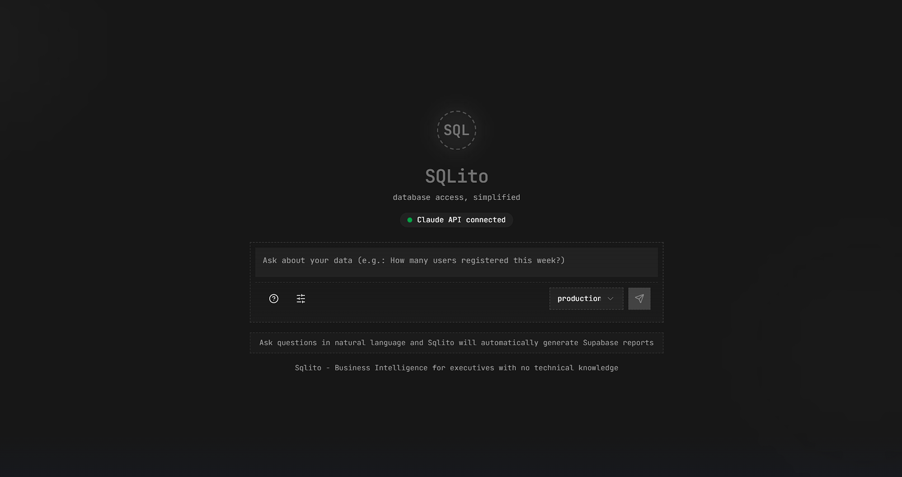

# 😎 SQLito - Business Intelligence for Tech-Challenged Bosses
**Turn natural language questions into Supabase reports using AI**  
*No SQL knowledge required! For bosses who love data but hate complicated tech stuff.*

[](https://supabase.com)
[](https://nextjs.org)
[](https://anthropic.com)
[](https://modelcontextprotocol.io)

> 🏆 This project was built for the [Supabase Hackathon](https://x.com/supabase/status/1905603458742505516)



## 🚀 Main Features
- **1-click connection** to your Supabase database
- **Natural language chat** for queries in plain English or Spanish:
  - *"How many new users did we have this week?"*
  - *"Show me the best-selling products by region"*
  - *"Which client has the largest purchase history?"*
- **Automatic SQL generation** with visible query code for transparency
- **Real-time results** in formatted tables and data summaries
- **Multiple database support** - switch between production, development, and analytics environments
- **Message management** - copy, delete, and regenerate query results
- **Export to PDF/CSV** to share with your team
- **Security guaranteed** with Supabase RLS and read-only access

## 💻 Tech Stack
| Layer         | Technologies                                                                |
|---------------|----------------------------------------------------------------------------|
| **Frontend**  | Next.js, React, Tailwind CSS, Chart.js                                      |
| **Backend**   | Next.js API Routes, Model Context Protocol (MCP)                            |
| **AI**        | Claude 3 Sonnet (via Anthropic API)                                         |
| **Database**  | Supabase PostgreSQL                                                         |
| **Deploy**    | Vercel                                                                      |

## 👀 How It Works
1. **Connect your Supabase database** with a single click
2. **Configure your Claude API key** for AI processing (stored securely)
3. **Chat with your data** using natural language
4. **Receive formatted results** with generated SQL and visual data representations
5. **Switch between databases** to query different environments

## 🛠️ Quick Setup
### Requirements
- Node.js 18+
- Account on [Supabase](https://supabase.com)
- API Key from [Anthropic](https://console.anthropic.com) (Claude 3)

### Steps
1. Clone repository:
```bash
git clone https://github.com/valentin-marquez/sqlito.git
cd sqlito
```
2. Install dependencies:
```bash
npm install
# or
yarn install
```
3. Create `.env.local` file with:
```bash
ANTHROPIC_API_KEY=your_api_key_here  # Only for development
NEXT_PUBLIC_SUPABASE_URL=your_supabase_project_url
NEXT_PUBLIC_SUPABASE_ANON_KEY=your_supabase_anon_key
```
4. Start the development server:
```bash
npm run dev
# or
yarn dev
```
5. Open [http://localhost:3000](http://localhost:3000) to access SQLito

## 🔒 Security
- All database queries are **read-only**
- User API keys are **stored locally** in the browser
- Database credentials are **never exposed** to the frontend
- Supabase Row-Level Security (RLS) provides **additional protection**